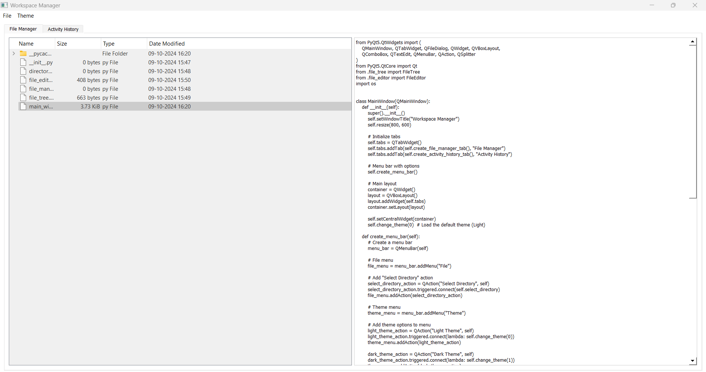

# Workspace Manager

This project is a lightweight workspace manager with a custom taskbar that includes additional features to improve productivity. It offers a streamlined UI, custom application launchers, clipboard history, URL management, and more.

## Features

- **Secondary Taskbar**: A custom taskbar that remains on top and includes multiple functionality buttons.
- **Custom Application Launchers**: Quickly access frequently used applications or scripts via a configurable launcher.
- **Clipboard Manager**: View and manage clipboard history with easy access.
- **URL List**: Display and save open URLs from supported browsers in a convenient notepad interface.
- **Customization Options**: Minimize, resize, and snap the taskbar to different screen edges.

## Screenshots

### Initial Build



The initial layout of the Workspace Manager includes a custom taskbar with essential features such as a launcher for applications, clipboard history access, and taskbar customization options.

### Updated Taskbar with Additional Features


The latest version includes additional buttons for managing URLs and other utility functions, along with an improved layout that supports snapping to screen edges and adjusting to either horizontal or vertical orientation.

## Usage

1. **Launcher Setup**: 
   - Add custom entries in the launcher for frequently used applications or scripts.
   - Each entry allows specifying an application path and optional parameters.
  
2. **Clipboard Manager**:
   - Access clipboard history to easily view or manage copied items.
  
3. **URL List**:
   - The URL List feature shows a list of open URLs across browsers.
   - You can save the list to a text file.

## Getting Started

1. Clone the repository:
    ```bash
    git clone https://github.com/yourusername/workspace-manager.git
    ```
2. Install dependencies:
    ```bash
    pip install -r requirements.txt
    ```
3. Run the application:
    ```bash
    python main.py
    ```

## Future Plans

- Integration with more applications and services.
- Enhanced customization options.
- Further refinements to UI and taskbar features.
